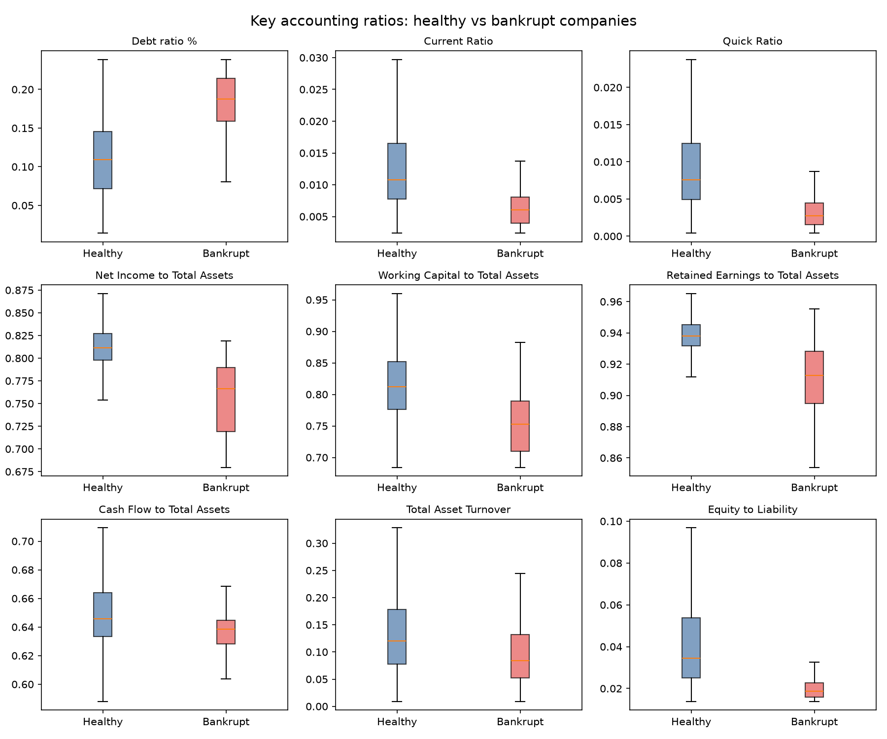
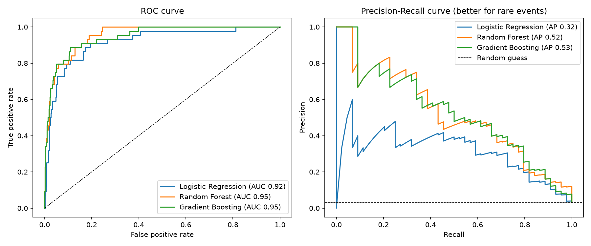
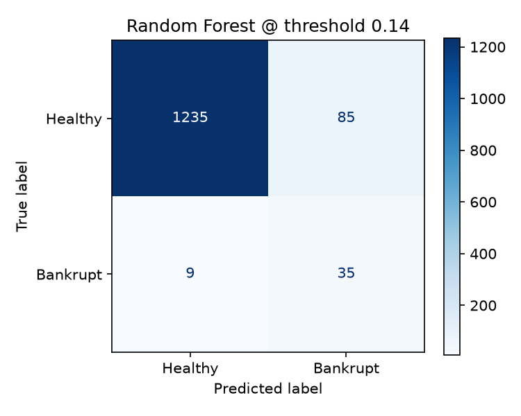

# Machine Learning Prediction of Corporate Bankruptcy

## Overview

This project predicts whether a company will go bankrupt using financial ratios taken from its financial statements. The dataset contains 6,819 Taiwanese companies with 95 financial ratios and a binary target variable showing whether the company went bankrupt.

The aim of the project was to apply machine learning to a real finance and accounting problem. Lenders, auditors and investors need early warning of financial distress, and missing a company that later fails is far more costly than reviewing a healthy one. The models were therefore evaluated on a **business cost** rather than accuracy alone.

## Project Objectives

- Explore and clean financial-statement data
- Compare key accounting ratios (leverage, liquidity, profitability, efficiency) between healthy and bankrupt companies
- Build and compare machine learning classification models
- Handle severe class imbalance (~3% bankrupt)
- Choose a decision threshold that minimises business cost
- Export results to Excel for non-technical users

## Methods

The project included:

- Data cleaning (duplicates, constant columns, missing values)
- Exploratory analysis of key accounting ratios
- Stratified train/test split (80/20)
- Logistic Regression (with feature standardisation)
- Random Forest
- Gradient Boosting
- Class-weighted training to handle imbalance
- Cost-based threshold tuning using 5-fold cross-validation (missed bankruptcy = 10, false alarm = 1)
- Evaluation with ROC-AUC, PR-AUC, Recall, Precision and business cost

## Dataset

- Source: Kaggle, [Company Bankruptcy Prediction](https://www.kaggle.com/datasets/fedesoriano/company-bankruptcy-prediction) (Taiwan Economic Journal, 1999–2009)
- 6,819 companies
- 95 financial ratio features
- Binary target: `Bankrupt?` (1 = bankrupt, 0 = healthy)
- Significant class imbalance (~97% healthy, ~3% bankrupt)

### Key Ratios

**Debt ratio %**: total liabilities as a share of total assets (leverage)

**Current Ratio / Quick Ratio**: ability to pay short-term obligations (liquidity)

**Net Income to Total Assets**: return on assets (profitability)

**Working Capital to Total Assets**: short-term financial cushion

**Retained Earnings to Total Assets**: accumulated profitability over time

**Cash Flow to Total Assets**: cash generated relative to company size

**Total Asset Turnover**: how efficiently assets generate revenue

**Equity to Liability**: how much the company is funded by owners vs lenders

## Exploratory Data Analysis

Bankrupt companies had a median debt ratio of 0.187 compared with 0.109 for healthy companies, suggesting that failed firms relied more heavily on debt financing.

Healthy companies reported a median net income to total assets ratio of 0.811, compared with 0.766 for bankrupt companies, suggesting greater profitability.

The median working capital to total assets ratio was 0.812 for healthy firms versus 0.753 for bankrupt firms, indicating stronger financial flexibility among non-bankrupt companies.

Healthy firms had a median retained earnings to total assets ratio of 0.938, compared with 0.913 for bankrupt firms, reflecting a stronger accumulation of earnings over time.




## Key Results

<!-- Fill in from report/model_comparison.csv -->

| Model | ROC-AUC | PR-AUC | Recall (bankrupt) | Precision (bankrupt) | Business cost |
|---|---|---|---|---|---|
| Random Forest |0.954 |0.523 |0.795 |0.292 |175 |
| Gradient Boosting |0.947 |0.528 | 0.727  |0.356 |178 |
| Logistic Regression |0.917 |0.319 |0.727 | 0.305  |193 |

- The Random Forest model achieved the lowest business cost, catching 14% of bankruptcies in the test set.
- The most important predictors were **[from figures/06_feature_importance.png]**.
- Tuning the threshold for business cost caught more bankruptcies than the default 50% cut-off, at the cost of more false alarms.





## Excel Output

`report/bankruptcy_risk_results.xlsx` contains:

- **Model Comparison**: scores for each model
- **Ratios by Outcome**: median key ratios for healthy vs bankrupt companies
- **Test Predictions**: each test company's bankruptcy probability, ranked from riskiest
- **Scorecard Coefs**: coefficients of a simple logistic model on the key ratios

## Limitations

- Data covers Taiwanese companies from 1999–2009, so results may not generalise to other countries or time periods
- Ratios are anonymised and pre-scaled, so they can't be traced back to specific companies

## How to Run

```
pip install -r requirements.txt
python main.py
```

Download `data.csv` from Kaggle into the `dataset/` folder first.

## Technologies Used

- Python
- Pandas
- NumPy
- Scikit-learn
- Matplotlib
- Excel (openpyxl)
- Machine Learning
- Financial Ratio Analysis
